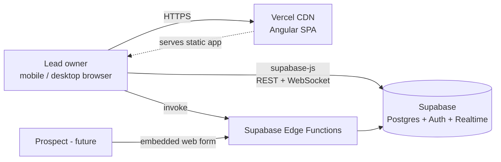
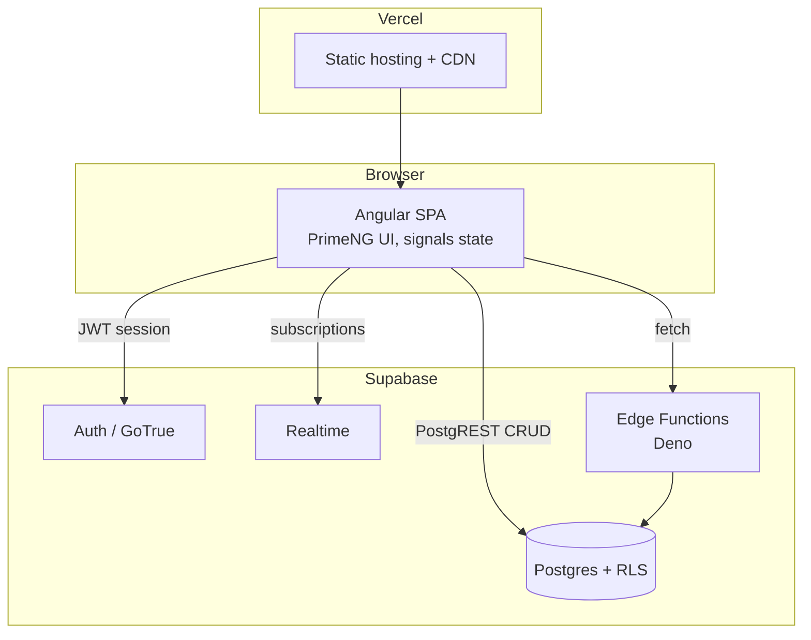

# Architecture — LeadFlow Manager

> Derived from `documents/Product Requirements Document LeadFlow Manager.md`. Last updated: 2026-08-02

## 1. Overview

LeadFlow Manager is a mobile-first web application for small businesses, freelancers, and lead-management beginners to capture, track, and convert sales leads. The solution is a **backend-less architecture**: an Angular single-page application talks directly to **Supabase** (managed PostgreSQL, Auth, Realtime, Storage) via the Supabase JS client. The product is **multi-tenant**: data belongs to a tenant (a business), users join tenants via memberships, and Row Level Security enforces isolation per tenant — launch users simply get an auto-created personal tenant. Custom server-side logic, when needed (e.g. scheduled reminder generation, future web-form ingestion), will be handled by **Supabase Edge Functions or a .NET minimal API** — evaluated per case when the need arises (see §6). The Angular app is served as a static build from **Vercel**. The product is delivered in **Hebrew with RTL layout**.

## 2. System context

### Actors
- **Tenant owner** — a small-business owner / freelancer who created the tenant; manages leads and (future) invites members. Authenticated via Supabase Auth.
- **Tenant member** (future-enabled) — a teammate invited into the tenant; works the same lead pipeline with member role.
- **Anonymous prospect** (future) — submits an embeddable web form that creates a lead.

### External systems
| System | Role |
|---|---|
| Supabase | Postgres DB, Auth (email/password + OAuth-ready), Realtime subscriptions, Edge Functions |
| Vercel | Static hosting + CDN for the Angular build, preview deployments per PR |
| Email provider (via Supabase Auth) | Auth emails (confirmation, password reset) |

### Context diagram



## 3. High-level architecture

### Monorepo layout

```
LeadFlow/
├── client/            # Angular 20 SPA (standalone components, PrimeNG 20)
│   └── supabase/      # Supabase CLI project: migrations/, functions/, config.toml
├── docs/              # PRD, ARCHITECTURE, DESIGN-SYSTEM, DEV-HANDOFF, adr/
└── (root)             # CLAUDE.md, CHANGELOG.md, STATUS.md, TASKS.md
```

No `api/` folder at launch — the PRD requires no custom backend for core functionality. If server-side logic later warrants a .NET minimal API (see §6), it is added as `api/` alongside the existing folders with an accompanying ADR. **Supabase CLI migrations are the schema source of truth** (SQL files under `client/supabase/migrations/`), replacing the usual EF Core default. The CLI sits beside the app as a `client/` devDependency, so it is invoked as `npx supabase <cmd>` from `client/` — there is no global install to keep in sync.

### Container diagram



### Key journeys

**1. Capture a lead (manual entry)**
1. User opens the "add lead" form (PrimeNG dialog/drawer, touch-optimized).
2. Angular validates inputs (reactive form + inline guidance tooltips).
3. `supabase.from('leads').insert(...)` with the active `tenant_id` — RLS verifies membership.
4. Realtime subscription (or optimistic update) refreshes dashboard List/Kanban.
5. App prompts the guided next step ("New lead — time to qualify!").

**2. Advance a lead on the Kanban**
1. User drags a card between stage columns (touch drag-and-drop).
2. Optimistic UI move; `update leads set status = ...` behind it.
3. A DB trigger appends a `status_changed` entry to `activities`.
4. Status-guidance copy for the new stage is shown. ~~If the stage implies follow-up (e.g. "Proposal Sent"), a reminder row is created (trigger or client-side rule).~~ **Superseded 2026-08-03 — see §6.1: no reminder row is written on a stage move.**
5. Qualification checklist is **advisory, never blocking**: stage moves are always allowed; if checklist items are unanswered at move time, a gentle dismissible nudge offers to fill them in ("2 questions unanswered — fill in now?").

## 4. Stack decisions

| Layer | Choice | Version | Why | Alternatives considered |
|---|---|---|---|---|
| Frontend framework | Angular | 20.x | PRD-mandated; strong forms/validation for guided UX | React/Vue — rejected, PRD names Angular |
| UI components | PrimeNG | 20.x (MIT) | PRD-mandated; core remains MIT/free — only LTS contracts and premium templates are paid. Rich mobile-friendly set (DataView, drag-drop, charts) with built-in RTL support | Angular Material (weaker Kanban/table story), pinning old PrimeNG v17 (no benefit — core license unchanged) |
| State | Angular signals + services | built-in | App scale is small; avoids NgRx ceremony | NgRx/SignalStore — revisit if state grows |
| Backend | None (Supabase direct) | — | PRD-mandated: PostgREST + RLS covers CRUD; Edge Functions for the rest | .NET minimal API — rejected, contradicts PRD |
| Database & Auth | Supabase (Postgres 15+) | cloud | PRD-mandated: managed Postgres, integrated auth, realtime | Firebase (no SQL/RLS), self-hosted Postgres (ops burden) |
| Migrations | Supabase CLI SQL migrations | latest | Native to the platform; versioned SQL in git; local dev via `supabase start` | EF Core (needs a .NET layer that doesn't exist here) |
| Server logic | Supabase Edge Functions (Deno/TS) **or** .NET minimal API | latest / .NET 9+ | Decided per case when server-side logic is needed: Edge Functions for small, Supabase-native tasks (scheduled jobs, webhooks); .NET if logic grows complex, needs rich libraries/testing, or long-running work | Committing to one upfront — rejected, no server logic exists yet |
| Hosting | Vercel | — | User choice; zero-config Angular static deploys, preview URLs per PR | Cloudflare Pages |
| Charts (analytics) | PrimeNG Chart (Chart.js) | bundled | Ships with PrimeNG; covers pipeline/source breakdown charts | ngx-charts, ECharts (heavier) |

## 5. Data architecture

### Core entities

```mermaid
erDiagram
    TENANTS ||--o{ MEMBERSHIPS : has
    PROFILES ||--o{ MEMBERSHIPS : joins
    TENANTS ||--o{ LEADS : owns
    LEADS ||--o{ ACTIVITIES : has
    LEADS ||--o{ REMINDERS : has
    LEADS ||--o{ QUALIFICATION_ANSWERS : has

    TENANTS {
        uuid id PK
        text name "business name"
        timestamptz created_at
    }
    MEMBERSHIPS {
        uuid tenant_id PK_FK
        uuid user_id PK_FK "= auth.users.id"
        member_role role "owner | member"
        timestamptz created_at
    }
    PROFILES {
        uuid id PK "= auth.users.id"
        text display_name
        timestamptz created_at
    }
    LEADS {
        uuid id PK
        uuid tenant_id FK
        uuid created_by FK "user who added the lead"
        uuid assigned_to FK "nullable - owning member"
        text name
        text email
        text phone
        text company
        lead_source source
        uuid stage_id FK "pipeline_stages - replaced the lead_status enum, 2026-08-04"
        numeric estimated_value
        text lost_reason
        boolean is_demo "sample lead from onboarding"
        int sort_order "kanban position within column"
        timestamptz created_at
        timestamptz updated_at
    }
    ACTIVITIES {
        uuid id PK
        uuid lead_id FK
        uuid tenant_id FK
        uuid created_by FK
        activity_type type "call | email | meeting | note | status_changed"
        text body
        timestamptz occurred_at
    }
    REMINDERS {
        uuid id PK
        uuid lead_id FK
        uuid tenant_id FK
        uuid assigned_to FK "who should follow up"
        text title
        timestamptz due_at
        timestamptz done_at
        timestamptz created_at
    }
    QUALIFICATION_ANSWERS {
        uuid lead_id PK_FK
        checklist_item item PK "interest | need | budget | authority | timeline"
        uuid tenant_id FK
        qualification_answer answer "yes | no | unknown"
        uuid answered_by FK
        timestamptz answered_at
    }
```

- ~~`lead_status` enum~~ **dropped 2026-08-04.** The Kanban columns are `pipeline_stages` rows per tenant, carrying a `stage_kind` of `open`/`won`/`lost`; see §6.2. The guidance copy that used to live in the client as Hebrew strings keyed by status now lives on the row (`meaning`, `guidance`), because a stage the user invented needs copy the client cannot have been written with.
- `stage_kind` enum: `open`, `won`, `lost` — what a stage *means*, as opposed to what the user calls it. Every figure on `/insights` and every closing rule keys off this.
- `lead_source` enum: `website`, `referral`, `social_media`, `phone`, `other` — powers the source-breakdown analytics.
- `automation_trigger` / `automation_action` enums: see §6.2.
- `updated_at` maintained by trigger; `status_changed` activity rows appended by trigger on `stage_id` transitions, recording `from_stage_id` / `to_stage_id` plus a text snapshot of the names as they read at the time.
- **Qualification checklist (per PM decisions, `documents/Lead Qualification Checklist - PM Decisions.md`):** fixed 5-item V1 checklist — `checklist_item` enum `interest`, `need`, `budget`, `authority`, `timeline` (this order; not classic BANT order). Answers are **tri-state** (`yes` / `no` / `unknown` — "no" and "haven't asked" are different signals) stored per lead in `qualification_answers` with timestamp + who answered, keyed `(lead_id, item)`. Stored (not ephemeral) to power future analytics insights ("leads with confirmed budget close more often"). Uniform across lead sources; item copy lives in the client strings module, not the DB. V2 backlog: user-added custom items (core items never deletable).

### Multi-tenancy

Tenant-based from day one — the product is multi-tenant even though launch users are solo:

- **`tenants`** is the ownership boundary. Every business-data row (`leads`, `activities`, `reminders`) carries `tenant_id uuid not null` — never a bare user id.
- **`memberships`** links users to tenants with a role (`owner`, `member`; finer roles later). A user can belong to multiple tenants (e.g. a freelancer serving two businesses); the client keeps an "active tenant" context.
- **Onboarding:** signup trigger auto-creates a personal tenant + `owner` membership, so the solo-user launch experience is unchanged — teams are enabled later by simply inserting more memberships (invite flow is post-launch, §12). The trigger also inserts **one sample lead** (`is_demo = true`, Hebrew demo content) so first-time users see a populated Kanban; demo leads are deletable and excluded from analytics.
- **Attribution vs ownership:** `created_by` / `assigned_to` columns reference users for display and assignment, but access control is decided only by `tenant_id`.
- Tenant-scoped indexes: `(tenant_id, status)`, `(tenant_id, created_at)` on `leads`; `(tenant_id, due_at)` on `reminders`.

### Migration strategy
Supabase CLI, run from `client/`: `npx supabase migration new <name>` → SQL file in `client/supabase/migrations/` → applied to the dev instance via `npx supabase db push` (CLI linked to dev project); same files pushed to prod once it exists. No `seed.sql` is used — the first-run demo lead is created per user by the signup trigger, not seeded, so it exists in production too.

### RLS posture
- RLS **enabled on every table**; no table is exposed without policies.
- Policy pattern for business tables: membership check via a `security definer` helper to avoid recursive-policy pitfalls and keep policies fast:
  ```sql
  create function public.is_tenant_member(t uuid) returns boolean
  language sql stable security definer set search_path = public as
  $$ select exists (select 1 from memberships
                    where tenant_id = t and user_id = auth.uid()) $$;

  -- per table: using (is_tenant_member(tenant_id))
  --            with check (is_tenant_member(tenant_id))
  ```
- Role-sensitive operations (delete tenant, manage members) additionally check `role = 'owner'` in the policy.
- `memberships`: users can select rows of tenants they belong to; only tenant `owner` can insert/delete memberships.
- `profiles`: row auto-created by trigger on `auth.users` insert; user can select/update only their own row; tenant co-members can select each other's profiles (for assignment display).
- The publishable key (`sb_publishable_…`) ships in the client — safe only because RLS is the enforcement boundary. **Every migration adding a table must include its policies in the same migration.**

## 6. API design

No custom REST API. Data access via Supabase auto-generated PostgREST endpoints through `supabase-js` v2.

- **Auth:** Supabase Auth JWT, auto-refreshed by the client SDK. Email/password at launch; OAuth providers can be toggled later without code changes.
- **Error envelope:** PostgREST errors normalized in one Angular `SupabaseService` wrapper — components never parse raw PostgREST errors. User-facing messages in Hebrew.
- **Pagination:** `.range()` keyset/offset on list views; dashboard loads are per-tenant and small, so offset pagination is acceptable at this scale.
- **Realtime:** Postgres Changes subscription on `leads` (filtered by active `tenant_id`, RLS-enforced) to keep List/Kanban live across devices, tabs, and teammates.
- **Server-side logic — Edge Functions vs .NET (per-case decision):** no server logic exists at launch. When a need arises, choose per case:
  - **Supabase Edge Functions (Deno/TS)** — default for small, Supabase-native tasks: scheduled jobs, DB webhooks, simple public endpoints. Zero extra infrastructure.
  - **.NET minimal API** — if the logic becomes complex, needs the .NET ecosystem (rich libraries, strong typing, testability), integrations, or long-running/background work. Would live in a new `api/` folder in the monorepo and record an ADR when introduced.
- **Candidate server-side tasks (initial set):**
  - ~~`reminders-due` — scheduled (pg_cron → function or Supabase Cron) computation of due follow-up reminders based on status + last activity. Likely Edge Function.~~ **Withdrawn 2026-08-03 — see §6.1.** The notification-channel decision stands: **in-app only at launch** — reminders list + badge + toast on login; email digest is a later add, push/PWA out of scope for v1.
  - `capture-form` (future) — public endpoint for embeddable web forms; rate-limited, validates + inserts lead for the form's owner.
- **Idempotency / rate limiting:** relevant only to `capture-form`; design it with a per-form token + basic rate limit when built.

### 6.2 Stages are rows, and automations run in the database (2026-08-04)

Two changes this section has to record, because both contradict what it said before.

**The six stages are no longer an enum.** `public.lead_status` has been dropped. Stages are
per-tenant `pipeline_stages` rows the owner can rename, reorder, add and archive. Every product
semantic hangs off a reserved `kind` (`open` / `won` / `lost`), never off a name or a position —
that is what lets someone rename נסגר בהצלחה without moving a single figure on `/insights`.
Rationale in full: `documents/PLAN-stages.md`. Invariants the database enforces rather than
trusting a client with: exactly one live won and one live lost stage, at least one live open
stage (a deferrable constraint trigger), and `on delete restrict` on every stage foreign key so
an accidental delete fails loudly instead of taking leads with it.

Three rules that used to be hardcoded on stage names are now properties of a stage row:
`expects_reply` replaces `status = 'proposal_sent'`, the lowest-position open stage replaces
`'new'`, and a per-stage `drift_days` replaces the `DRIFT_DAYS` map. A user's own
"waiting for signature" stage therefore behaves like the built-in proposal stage with nobody
writing code.

**Automations execute in Postgres, and §6's "no server logic exists at launch" still holds.**
Nothing was deployed. Reminders, notes, assignments and move *suggestions* are single statements,
so they run inside the stage-change transaction — a rolled-back move sends nothing, which is the
property an outbox exists to buy, obtained for free. The one action that leaves the database, a
webhook, uses `pg_net`: Postgres queues the request and a background worker sends it, so no user's
stage move ever waits on a remote host. `pg_cron` sweeps delayed rules and reconciles webhook
responses. `pgcrypto` signs them.

New extensions, all enabled by migration: `pg_cron`, `pg_net`, `pgcrypto`. Supabase Vault holds
webhook signing secrets; the rule row stores only the secret's name.

**Nothing here moves a lead on the user's behalf.** The `suggest_advance` action writes a note
proposing a stage change and deliberately does not touch `leads.stage_id`. That was a product
decision (2026-08-03) and it is the one place this subsystem could have contradicted the
advisory-never-blocking principle.

**What will eventually force an Edge Function is receiving, not sending.** Postgres can make an
outbound request; it cannot be a public HTTP endpoint. Email bounce handling, WhatsApp delivery
receipts and the `capture-form` endpoint all need one — see GAPS G-39.

**One release condition, recorded here so it is not lost in a migration header.** `pg_net` cannot
resolve a hostname before sending, so the webhook URL guard is a string check: a host whose DNS
answers with a private address would still be reached. Only a tenant owner can create an
automation today, aiming at their own endpoint. **Before the first external tenant**, move that
sender into an Edge Function that resolves and validates first, or restrict webhook hosts to an
owner-confirmed allowlist. GAPS G-41.

### 6.1 Reminders: derived urgency, not a generated row (decision, 2026-08-03)

This section replaces the reminder-generating trigger promised in §3 step 4 and the
`reminders-due` scheduled job listed above. Neither was ever built. What shipped instead is
better, and the difference is worth writing down because the original design is the obvious
one and someone will propose it again.

**The product has two distinct things**, and only one is a row:

| | Explicit reminder | Derived urgency |
|---|---|---|
| Source | a `public.reminders` row with `due_at` | `openReason()` in `leads.store.ts`, recomputed on every read |
| Written by | the user — lead detail, the reminders list's suggestion band, snooze | nobody; it is a function of `status` and `last_touch_at` |
| Examples | "call Thursday" | `proposal_silent` (3 silent days), `unqualified` (new, unanswered, 1 day), `drifting` (`DRIFT_DAYS`) |
| Can be completed | yes — `done_at` | no; it stops being true when the lead changes |
| Can be rescheduled | yes | meaningless |

**Why the generator is not built.** A row that restates what the client already computes
creates a second source of truth for the same fact, and the two drift: the row says "this
proposal is silent" on the strength of yesterday's data, the rule says otherwise today, and
the user sees both. A derived rule cannot go stale, cannot double-fire on a retried cron run,
needs no scheduling infrastructure, and costs nothing to change — the thresholds live in one
client constant rather than in a deployed function's history of rows.

**What each surface therefore shows:**

- **`/reminders`** — the explicit rows: overdue, today, upcoming. Completable and
  reschedulable, because those verbs are what makes a list a reminders list. Below a rule, a
  capped **suggestions** band lists leads that derived urgency flags and that have no reminder
  of their own, each offering one tap to turn a vague nudge into a dated commitment. Those
  suggestions are never counted anywhere.
- **The masthead badge** — `overdue + due-today rows` only. Five drifting leads produce no
  badge: nothing is *scheduled*. The bell is the user's own calendar; derived urgency already
  has the day sheet, the register's attention flags and the urgency sort.
- **The day sheet (2.1)** — derived urgency, as it always has.

**Revisit when, and only when,** a reminder must reach someone who is not looking at the app —
the email digest, which PRODUCT.md defers. At that point a scheduled job is genuinely required,
because a client-side rule cannot send mail, and it should read the explicit rows rather than
regenerate them.

**`reminders.assigned_to` (G-7):** every write path records who scheduled the reminder — the
reminders store's insert, the day-sheet snooze, and `save_lead`, which uses `auth.uid()` so the
server decides rather than trusting a client-supplied id. Nothing reads it yet, and nothing
should while a tenant has one member: "assigned to <the only member>" on every row is noise.
Writing it now is what makes the display possible later, because it cannot be backfilled once
rows exist without inventing history. The read side — assignee name on the row, a member picker,
an assigned-to-me filter — arrives with invites (§5, SCREENS 8.3).

## 7. Frontend architecture

- **Angular 20, standalone components**, `provideRouter` with lazy-loaded feature routes:
  - `dashboard/` — List + Kanban toggle views, search/filter bar, guidance tips
  - `leads/` — lead detail (fields + qualification checklist + activity timeline + reminders), add/edit forms
  - `analytics/` — metrics overview, pipeline progress, source breakdown
  - `auth/` — sign in / sign up / reset
  - `core/` — `SupabaseService`, auth guard, error/toast service
- **State:** signal-based stores per feature (`LeadsStore` service holding signals + computed filters). Server is source of truth; optimistic updates for drag-and-drop with rollback on error. A `TenantContext` service in `core/` holds the active tenant (persisted per user); all queries scope to it.
- **Text direction / i18n:** Hebrew, RTL. `<html dir="rtl" lang="he">`; PrimeNG RTL mode enabled. **CSS logical properties only** (`margin-inline-start`, `padding-block`, etc.) — no left/right physicals. UI copy in Hebrew; a single strings/copy module keyed by feature so future i18n extraction is cheap (no full i18n framework at launch).
- **UI framework:** PrimeNG 20 (PRD-decided). Kanban drag-and-drop via **Angular CDK DragDrop** (decided): PrimeNG's `pDraggable` relies on HTML5 native DnD which lacks touch support; CDK handles touch properly and composes with PrimeNG-styled columns.
- **Qualification checklist UX (per PM decisions):** advisory only — never blocks stage moves; unanswered items trigger a dismissible nudge on move. Copy tone split: status nudges / empty states may be energetic ("Time to qualify!"), checklist questions themselves stay plain-conversational ("Are you talking to the decision maker?"), with optional "why ask?" guidance text around them. All in the Hebrew strings module.
- **Animations:** Angular animations for the PRD-required staggered loading and fade-in/slide-up; honor `prefers-reduced-motion`.
- **Design-system integration point:** tokens (colors, spacing, typography incl. Hebrew-capable font) come from `docs/DESIGN-SYSTEM.md` and map onto PrimeNG's theme designer/CSS variables. Font is NOT chosen here.

## 8. Non-functional requirements

| NFR | Target | PRD tie-back |
|---|---|---|
| Mobile performance | Fast first load on mid-range phones; lazy routes, PrimeNG tree-shaken, LCP < 2.5s on 4G | "Mobile-first design" |
| Responsiveness | Full function 360px → desktop; touch targets ≥ 44px | "optimal usability across devices" |
| Availability | Supabase + Vercel managed SLAs; no self-hosted components | "high availability" hosting requirement |
| Scalability | Per-tenant data volumes are small (100s–1000s of leads); Postgres indexes on `(tenant_id, status)`, `(tenant_id, created_at)` | "scalability" |
| Observability | Vercel analytics + Supabase logs/advisors; client error logging service (console at launch, pluggable Sentry later) | efficiency-gain metrics need usage data |
| Security | RLS everywhere, Supabase Auth, no secrets in client beyond the publishable key | "secure... protect user data and ensure privacy" |

## 9. Compliance & locale

- **Locale:** Hebrew UI, RTL layout (decided with product owner). All dates/numbers formatted with `he-IL` locale.
- **Israeli privacy law — Amendment 13 (in force Aug 2025):** the app stores prospects' personal data (name, email, phone) on behalf of users. Required posture:
  - Privacy notice covering what lead data is stored and why; consent/notice language in Hebrew.
  - Data minimization: only PRD-listed lead fields; no hidden collection.
  - Deletion: user can delete leads, and a tenant owner can delete the tenant (cascade delete of all tenant data); deleting an account removes the user's memberships, profile, and auth user — sole-owned tenants are deleted with it.
  - Data residency: Supabase project region chosen closest/appropriate (eu-central recommended); documented in privacy notice.
  - Security measures documented (RLS, TLS, auth) per the database-security regulations.
- **Accessibility:** WCAG 2.1 AA target — keyboard-accessible Kanban alternative (move via menu, not only drag), contrast per design system, `prefers-reduced-motion` respected.

## 10. Cross-cutting concerns

- **Logging:** central client `LoggerService`; Supabase/Postgres logs via dashboard; Edge Functions log to Supabase logs.
- **Config/secrets:** client gets only `SUPABASE_URL` + the publishable key (`sb_publishable_…`) via Angular environment files; the secret key (`sb_secret_…`) exists **only** in Edge Function secrets — never in the repo or client. Legacy `anon` / `service_role` JWTs are deprecated by end of 2026 and must not be introduced.
- **Error handling:** one error boundary path — `SupabaseService` normalizes errors → toast service shows Hebrew message → logger records detail.
- **Auth/authz:** Supabase Auth session in the SDK; Angular route guard redirects unauthenticated users; authorization is 100% RLS — the client never being trusted.
- **Caching:** signals stores cache per session; realtime keeps them fresh; no service-worker/PWA at launch (candidate later — §12).

## 11. Deployment & environments

Two environments only:

| Env | Client | Database |
|---|---|---|
| Local (dev) | `ng serve` on developer machine | Supabase cloud **dev** project (shared dev instance — no local Docker stack) |
| Production (when we get there) | Vercel production | Supabase cloud **prod** project |

- Dev: Angular environment file points at the dev project's URL + publishable key; migrations applied to dev via `supabase db push` (CLI linked to the dev project).
- Production (later): separate Supabase project + Vercel deploy from `main`; same migration files pushed to prod when it exists. Additive-first migrations to avoid breaking the live client.
- No preview environments / branch DBs for now — revisit if team grows.

## 12. Risks & open questions

Decided (moved into sections above): Kanban DnD = Angular CDK (§7); reminder notifications = in-app only at launch (§6); team invites = post-launch (§5); onboarding sample lead = yes (§5); qualification checklist = fixed 5-item, tri-state stored per lead, advisory (§5, §7 — full rationale in `documents/Lead Qualification Checklist - PM Decisions.md`).

Still open:
- **Web form capture:** explicitly future in PRD; `capture-form` Edge Function design (tokens, rate limits, spam) deferred until prioritized.
- **"Qualified" exit bar from "New" (soft):** PM defines leaving "New" as ≥1 logged interaction + partial checklist answers — implemented as guidance/nudge, not a gate; exact nudge copy finalized with design system.

## 13. Decisions log pointer

Key decisions are recorded as ADRs under `docs/adr/`.
